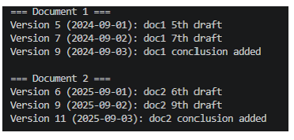
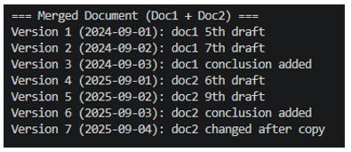
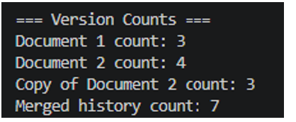

# Document History — Linked List Implementation

**Course:** CIS 2353 — Data Structures | **Project:** 2

A Java implementation of a singly linked list used to track document version histories. The program demonstrates core linked list operations including traversal, deep copying, and merging two lists into a third.

---

## Overview

`DocumentHistory` models a version control system where each document revision is stored as a node in a linked list. The project covers:

- Building and traversing a singly linked list from scratch
- Implementing a **deep copy constructor** that produces a fully independent clone of a list
- A **static merge method** that concatenates two histories into a new list with re-numbered versions
- Demonstrating copy independence by mutating the original after copying and confirming the copy is unchanged

---

## Project Structure

```
Project2/
├── src/
│   ├── VersionNode.java       # Linked list node (version, timestamp, description)
│   ├── DocumentHistory.java   # Linked list class with add, print, count, copy, merge
│   └── Main.java              # Driver — creates histories, copies, merges, prints results
├── Screenshots/               # Sample console output images
└── Part2/
    └── Part2.docx             # Written analysis
```

---

## Classes

### `VersionNode`
Represents a single revision in the history chain.

| Field | Type | Description |
|-------|------|-------------|
| `versionNumber` | `int` | Revision identifier |
| `timestamp` | `String` | Date of the revision |
| `description` | `String` | Short summary of changes |
| `next` | `VersionNode` | Pointer to the next node |

### `DocumentHistory`
The linked list container.

| Method | Description |
|--------|-------------|
| `DocumentHistory()` | No-arg constructor — creates an empty list |
| `DocumentHistory(DocumentHistory copy)` | Deep copy constructor — independent clone |
| `addVersion(int, String, String)` | Appends a new `VersionNode` to the end |
| `printHistory()` | Prints every node from head to tail |
| `getVersionCount()` | Returns the total number of versions |
| `mergeHistories(history1, history2)` *(static)* | Returns a new list containing all nodes of both histories, re-numbered sequentially |

---

## Sample Output

```
=== Document 1 ===
Version 5 (2024-09-01): doc1 5th draft
Version 7 (2024-09-02): doc1 7th draft
Version 9 (2024-09-03): doc1 conclusion added

=== Document 2 ===
Version 6 (2025-09-01): doc2 6th draft
Version 9 (2025-09-02): doc2 9th draft
Version 11 (2025-09-03): doc2 conclusion added

=== Copy of Document 2 ===
Version 6 (2025-09-01): doc2 6th draft
Version 9 (2025-09-02): doc2 9th draft
Version 11 (2025-09-03): doc2 conclusion added

=== Document 2 After Modification ===
Version 6 (2025-09-01): doc2 6th draft
Version 9 (2025-09-02): doc2 9th draft
Version 11 (2025-09-03): doc2 conclusion added
Version 13 (2025-09-04): doc2 changed after copy

=== Copy of Document 2 (Should Be Unchanged) ===
Version 6 (2025-09-01): doc2 6th draft
Version 9 (2025-09-02): doc2 9th draft
Version 11 (2025-09-03): doc2 conclusion added

=== Merged Document (Doc1 + Doc2) ===
Version 1 (2024-09-01): doc1 5th draft
Version 2 (2024-09-02): doc1 7th draft
Version 3 (2024-09-03): doc1 conclusion added
Version 4 (2025-09-01): doc2 6th draft
Version 5 (2025-09-02): doc2 9th draft
Version 6 (2025-09-03): doc2 conclusion added
Version 7 (2025-09-04): doc2 changed after copy

=== Version Counts ===
Document 1 count: 3
Document 2 count: 4
Copy of Document 2 count: 3
Merged history count: 7
```

---

## Screenshots

| Description | Preview |
|-------------|---------|
| Printing each history |  |
| Deep copy — independence confirmed | .png) |
| Merged history output |  |
| Version counts |  |

---

## How to Run

**Prerequisites:** Java 11+, VS Code with the Java Extension Pack (or any Java IDE)

```bash
# Compile
javac Project2/src/*.java -d Project2/bin

# Run
java -cp Project2/bin Main
```

Or open the project folder in VS Code and use the **Run** button in `Main.java`.

---

## Key Concepts Demonstrated

- **Singly linked list** — manual pointer management with no built-in collections
- **Deep copy** — node-by-node cloning so mutations to the original don't affect the copy
- **List merging** — sequential concatenation with version re-numbering
- **OOP principles** — encapsulation via private fields and public accessors, `toString` override for clean printing
